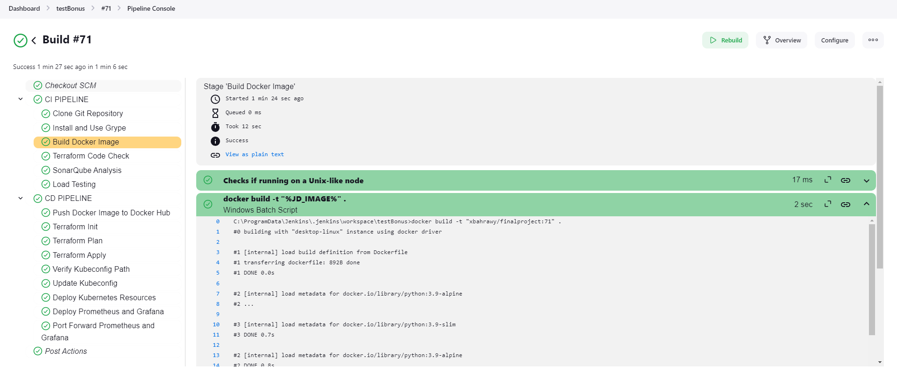
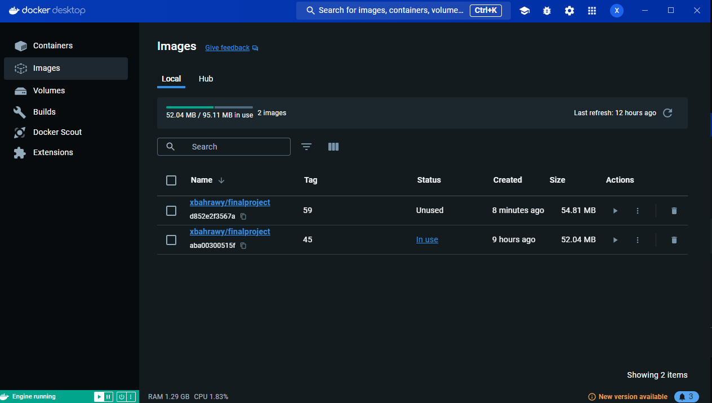
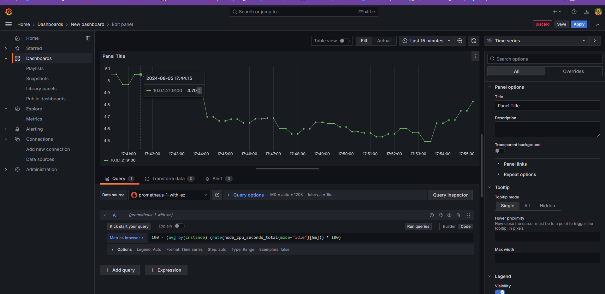
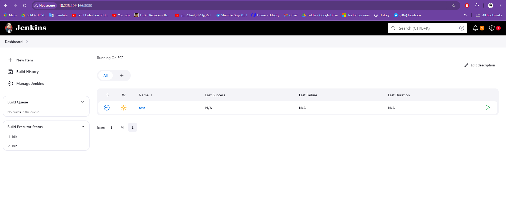
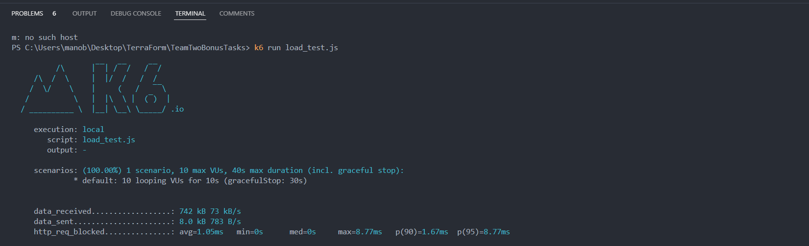
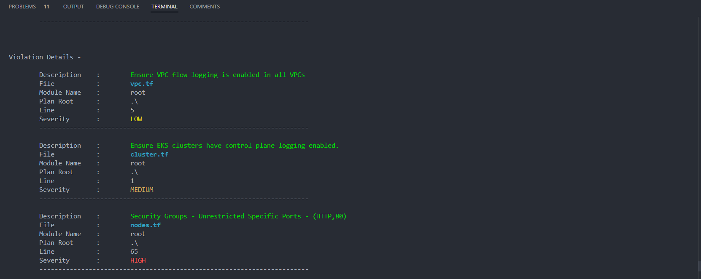
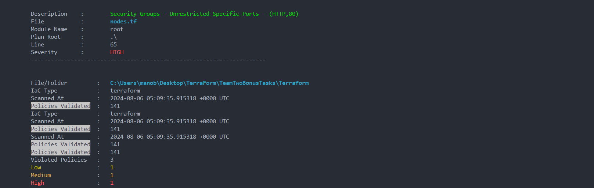
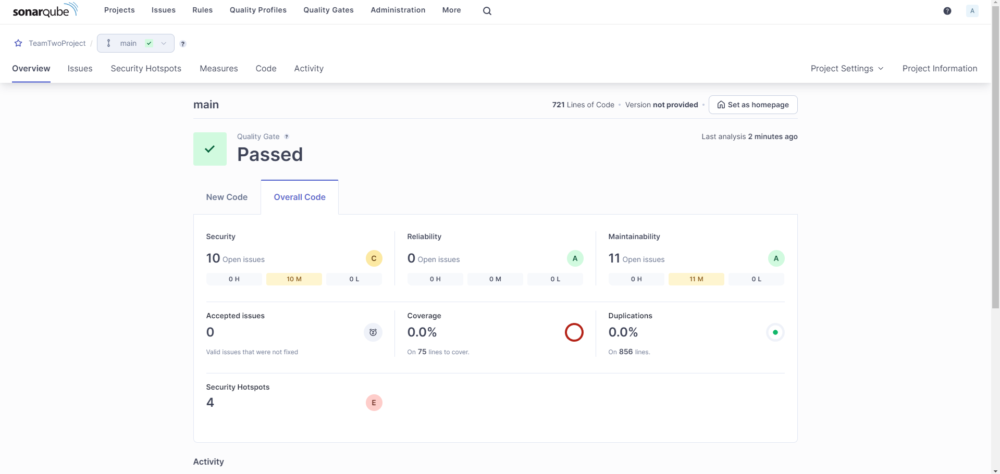
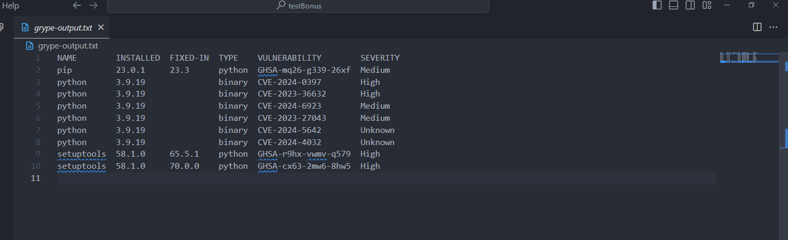

# Project Setup and Execution Guide

## Step 1: Run the Flask Application

First, we need to set up and run the Flask application locally.

### Code to Set Up the Flask Environment

# Step 1.1: Install Python Dependencies
pip install -r requirements.txt

# Step 1.2: Run the Flask Application
python lms.py

This will start the Flask application locally on \`http://localhost:5000\`.

---

## Step 2: Dockerize the Application

Next, we'll containerize the application using Docker.

### Code to Build and Run the Docker Container

# Step 2.1: Build the Docker Image
docker build -t library-management-system .

# Step 2.2: Run the Docker Container
docker run -d -p 5000:5000 library-management-system

This command builds a Docker image for the application and runs it in a container.

---

## Step 3: Deploy the Application on Kubernetes (EKS)

Now, we will deploy the containerized application on an AWS EKS cluster.

### Code to Apply Kubernetes Configuration

# Step 3.1: Apply Kubernetes Configuration Files With All The prometheus And Grafana
-kubectl create namespace teamtwo-namespace
-kubectl apply -f namespace.yaml
-kubectl apply -f pv.yaml
-kubectl apply -f pvc.yaml
-kubectl apply -f grafana-deployment.yaml
-kubectl apply -f grafana-service.yaml
-kubectl apply -f prometheus-config.yaml
-kubectl apply -f prometheus-deployment.yaml
-kubectl apply -f prometheus-service.yaml
-kubectl apply -f servicemonitor.yaml
-kubectl apply -f alerts.yaml
-kubectl apply -f alertmanager-service.yaml
-kubectl apply -f alertmanager-deployment.yaml

This will deploy the application on your Kubernetes cluster and expose it to the internet.

---

### Step 3.2 Access Prometheus

Access Prometheus via the LoadBalancer IP or DNS:

\`\`\`url
http://<LoadBalancer-IP>:9090
\`\`\`

### Step 3.3 Access Grafana

Access Grafana via the LoadBalancer IP or DNS:

\`\`\`url
http://<LoadBalancer-IP>:3000
\`\`\`

---

## Step 4: Set Up CI/CD Pipeline with Jenkins

Finally, we'll automate the build and deployment process using Jenkins.

### Jenkins Pipeline Code

\`\`\`groovy
pipeline {
    agent any
    stages {
        stage('Build') {
            steps {
                echo 'Building...'
                sh 'docker build -t library-management-system .'
            }
        }
        stage('Test') {
            steps {
                echo 'Testing...'
                sh 'pytest'
            }
        }
        stage('Deploy') {
            steps {
                echo 'Deploying...'
                sh 'kubectl apply -f deployment.yaml'
            }
        }
    }
}
\`\`\`

This Jenkinsfile defines a pipeline with build, test, and deploy stages for automating the deployment of your application.

---

# Project Documentation with Images

## Full System Architecture

- **Our Fully Running Pipeline**: This image represents the overall architecture of our pipeline, showing the integration of various components from the application development stage to deployment, monitoring, and CI/CD automation.

## Docker Overview

- **Our Slim Docker Image**: This image illustrates the optimized Docker image used in our project. By utilizing a multi-stage build process and minimizing unnecessary layers, we managed to significantly reduce the image size, making it more efficient for deployment.

## Kubernetes Deployment

- **Our Grafana Dashboard Image**: This Grafana dashboard provides a visual representation of the metrics collected by Prometheus. It gives insights into various performance aspects of the deployed application, helping us monitor system health and performance.

## Jenkins on EC2

- **Our Running Jenkins on EC2**: This image captures the Jenkins instance running on an AWS EC2 instance. Jenkins is the backbone of our CI/CD pipeline, automating the process from code commit to deployment on the Kubernetes cluster.

-This one is a bit too much and we have tried so hard to make it work as you can see
- **Detailed Steps**
# Jenkins Trial Setup on EC2 with Docker

## EC2 Instance Creation

We created a public EC2 instance using Terraform. 

## Docker Installation


1. **Update the package index and install dependencies:**

    ```bash
    sudo apt update -y
    sudo apt install -y wget
    ```

2. **Download and install Docker:**

    ```bash
    wget https://download.docker.com/linux/ubuntu/dists/focal/pool/stable/amd64/docker-ce_20.10.17~3-0~ubuntu-focal_amd64.deb
    sudo dpkg -i docker-ce_20.10.17~3-0~ubuntu-focal_amd64.deb
    sudo apt install -y -f
    ```

3. **Start Docker:**

    ```bash
    sudo systemctl start docker
    ```


---


## Jenkins Setup

1. **Create a directory for Jenkins and create a Dockerfile:**

    ```bash
    mkdir jenkinsdir
    cd jenkinsdir
    nano Dockerfile
    ```

2. **Dockerfile content:**

    ```dockerfile
    # Use the official Jenkins base image
    FROM jenkins/jenkins:lts

    # Set environment variables to disable the setup wizard and allow non-interactive installation
    ENV JAVA_OPTS="-Djenkins.install.runSetupWizard=false"

    # Install any additional packages or tools you need
    USER root
    RUN apt-get update && apt-get install -y \
        curl \
        git \
        docker.io \
        && apt-get clean

    # Install plugins using the jenkins-plugin-cli
    COPY plugins.txt /usr/share/jenkins/ref/plugins.txt
    RUN jenkins-plugin-cli --plugin-file /usr/share/jenkins/ref/plugins.txt

    # Create a Jenkins user if it does not exist
    RUN useradd -m -s /bin/bash jenkins

    # Switch to the Jenkins user
    USER jenkins

    # Specify the default user for the container
    USER 1000
    ```

3. **Create the `plugins.txt` file:**

    ```bash
    nano plugins.txt
    ```

4. **`plugins.txt` content:**

    ```plaintext
    git
    kubernetes
    credentials-binding
    github
    docker-workflow
    docker-plugin
    docker-commons
    docker-build-step
    pipeline-stage-view
    kubernetes-cli
    workflow-aggregator
    ```

5. **Build the custom Jenkins image:**

    ```bash
    sudo docker build -t my-custom-jenkins .
    ```

6. **Run the Docker image on port 8080:**

    ```bash
    sudo docker run -d -p 8080:8080 --name jenkins my-custom-jenkins
    ```

7. **Verify Jenkins setup in a browser:**

    Open `http://public-ip:8080` in your browser to access Jenkins.


---

## Additional Tools Installation


1. **Install `kubectl`:**

    ```bash
    curl -LO "https://dl.k8s.io/release/$(curl -L -s https://dl.k8s.io/release/stable.txt)/bin/linux/amd64/kubectl"
    chmod +x ./kubectl
    sudo mv ./kubectl /usr/local/bin/kubectl
    ```

2. **Install Terraform:**

    ```bash
    sudo apt-get install wget unzip -y
    wget https://releases.hashicorp.com/terraform/1.9.3/terraform_1.9.3_linux_amd64.zip
    unzip terraform_1.9.3_linux_amd64.zip
    sudo mv terraform /usr/local/bin/
    ```

3. **Install AWS CLI:**

    ```bash
    sudo snap install aws-cli --classic
    ```

4. **Add binaries to system environment variables:**

    Use `which kubectl`, `which terraform`, and `which aws` to locate their paths and configure them in Jenkins for use in Jenkinsfiles.

## Credentials Setup

- Added Docker Hub and AWS credentials in Jenkins for Jenkinsfile integration.

## CI/CD Pipeline

- Created a CI/CD pipeline and tested it with our public GitHub repository.

## Challenges and Solutions

### Challenge: Disk Space Limitation

**Issue:**

The EC2 instance had an 8 GiB volume, and Jenkins encountered a disk space issue:

Disk space is below threshold of 1.00 GiB. Only 623.43 MiB out of 6.71 GiB left on /var/jenkins_home


## Solution

1. **Take a snapshot of the EBS volume to ensure data safety:**

    - Navigate to the AWS Management Console.
    - Go to the EC2 Dashboard.
    - Select "Snapshots" from the sidebar.
    - Create a snapshot of the existing volume.

2. **Increase EBS Volume Size:**

    - Go to the AWS Console.
    - Select the volume associated with your instance.
    - Click on "Actions" -> "Modify Volume".
    - Increase the size from 8 GiB to 30 GiB and confirm.

3. **Extend the Linux file system after resizing the volume:**

    ```bash
    df -hT
    sudo lsblk
    sudo growpart /dev/xvda 1
    sudo lsblk
    df -hT
    sudo resize2fs /dev/xvda1
    ```

4. **Verify Volume Expansion:**

    - **Before resizing:** `xvda1` was 7 GiB with 91% usage.
    - **After resizing:** `xvda1` became 29 GiB with 22% usage.


**At the end it failed because the instance kebt getting irresponsive every ehile so we set everything on the local host**


## Load Testing with K6

- **Our Load Tester**: This image shows the results of load testing conducted using K6. By simulating high traffic scenarios, K6 helps ensure that our application can handle the expected load without performance degradation.

## Terraform Vulnerability and Code Quality Testing


- **Our Terraform Security Scans**: These images display the output of Terrascan, a tool used to scan our Terraform code for vulnerabilities and compliance issues. Ensuring that our infrastructure-as-code is secure and follows best practices is crucial for the stability and security of our deployment.

##SonarQube

 **Our Sonarqube Stats**

## Conclusion
This documentation provides a comprehensive overview of our project, highlighting key stages such as Dockerization, Kubernetes deployment, CI/CD pipeline setup, and monitoring. The images included offer visual insights into the tools and processes we utilized to achieve a robust and scalable application deployment.

### Container Security with Grype

Grype was employed to scan Docker images for vulnerabilities, ensuring that the containers are secure before deployment.


### Problems Faced

1. **Reapplying the Terraform code which caused Redundancy Error**

    - **Problem**: Reapplying the Terraform code led to redundancy errors because resources were already created.
    
    - **Approaches**:
        1.1 **Bash Script for Resource Checking**: Developed a bash script to fetch existing resources from AWS and check if they are already present. If found, skip the corresponding Terraform command.
        
        1.2 **Bash Script for Resource Cleanup**: Created a bash script to destroy resources after the pipeline run, ensuring a clean slate for the next deployment.
        
        1.3 **Commenting the Apply Command**: Run Terraform apply command once and then comment it out in the script until further updates are needed (The simplest and most efficient approach).

2. **Terraform Configuration for the EKS Cluster**

    - **Problem**: Configuring the EKS cluster with the correct security group settings to allow traffic on specific ports.

    - **Approaches**:
        2.1 **Security Group Update**: Updated the Terraform code to add a new ingress rule to the security group. The revised security group configuration now includes the following ingress rule, which allows TCP traffic on port 8080 from any IP address:
        
        ```hcl
        resource "aws_security_group" "example" {
            # Other configurations...
        
            ingress {
                from_port   = 8080
                to_port     = 8080
                protocol    = "tcp"
                cidr_blocks = ["0.0.0.0/0"]
            }
            
            # Other configurations...
        }
        ```

3. **CI/CD Pipeline Integration Challenges**

    - **Problem**: Integrating various tools like SonarQube, k6, and Grype into the CI/CD pipeline and ensuring smooth execution.

    - **Approaches**:
        3.1 **SonarQube Configuration**: Ensured SonarQube was properly configured in Jenkins by setting up the SonarQube scanner as a Jenkins plugin, and configured the SonarQube server connection in Jenkins settings.
        
        3.2 **Sequential Stages**: Broke down the pipeline into sequential stages for code analysis (SonarQube), load testing (k6), and security scanning (Grype). This ensured each stage executed independently and provided clear feedback for each tool.

        3.3 **Docker Containers for Tools**: Used Docker containers to run tools like k6 and Grype to avoid environment conflicts on Jenkins. This also ensured consistent behavior across different pipeline executions.

4. **Kubernetes Deployment Issues**

    - **Problem**: Facing issues with deploying the application on Kubernetes, specifically with service exposure and pod configuration.

    - **Approaches**:
        4.1 **Debugging with kubectl logs**: Used `kubectl logs` to retrieve logs from failing pods, which helped diagnose issues like incorrect environment variables or image pull errors.
        
        4.2 **Rolling Update Strategy**: Implemented a rolling update strategy in the Kubernetes deployment configuration to ensure zero downtime during updates. This was done by setting `maxUnavailable` and `maxSurge` options in the deployment YAML.

        4.3 **Ingress Configuration**: Configured an Ingress resource to expose the services externally, instead of relying on LoadBalancer services, which helped to manage traffic routing more efficiently.

        ```yaml
        apiVersion: networking.k8s.io/v1
        kind: Ingress
        metadata:
          name: example-ingress
        spec:
          rules:
          - host: example.com
            http:
              paths:
              - path: /
                pathType: Prefix
                backend:
                  service:
                    name: example-service
                    port:
                      number: 80
        ```

        This configuration allowed external access to the application through a specified domain.

5. **Persistent Volume (PV) and Persistent Volume Claim (PVC) Binding Issues**

    - **Problem**: Encountered issues with Kubernetes Persistent Volume (PV) and Persistent Volume Claim (PVC) where the PVCs were stuck in a pending state and not getting bound to the PVs.

    - **Approaches**:
        5.1 **Correct Storage Class Configuration**: Ensured that the PV and PVC were using the correct storage class. If the storage class is not specified or mismatched, the PVC will not bind to the PV. Updated the YAML configuration to include the correct storage class:

        ```yaml
        apiVersion: v1
        kind: PersistentVolumeClaim
        metadata:
          name: example-pvc
        spec:
          storageClassName: "standard"  # Ensure this matches the PV's storage class
          accessModes:
            - ReadWriteOnce
          resources:
            requests:
              storage: 1Gi
        ```

        5.2 **Matching Labels and Selectors**: Ensured that the labels in the PV match the selectors in the PVC, which is required for the binding process. Updated the YAML configuration as follows:

        ```yaml
        apiVersion: v1
        kind: PersistentVolume
        metadata:
          name: example-pv
          labels:
            type: local
        spec:
          capacity:
            storage: 1Gi
          accessModes:
            - ReadWriteOnce
          hostPath:
            path: "/mnt/data"
        ---
        apiVersion: v1
        kind: PersistentVolumeClaim
        metadata:
          name: example-pvc
        spec:
          selector:
            matchLabels:
              type: local  # This label should match the PV's label
          accessModes:
            - ReadWriteOnce
          resources:
            requests:
              storage: 1Gi
        ```

        5.3 **Debugging Binding Issues**: Used `kubectl describe pvc <pvc-name>` to identify the exact reason why the PVC was not getting bound. Addressed the issues based on the error messages provided in the output.


Return to [Main Documentation](README.md).
